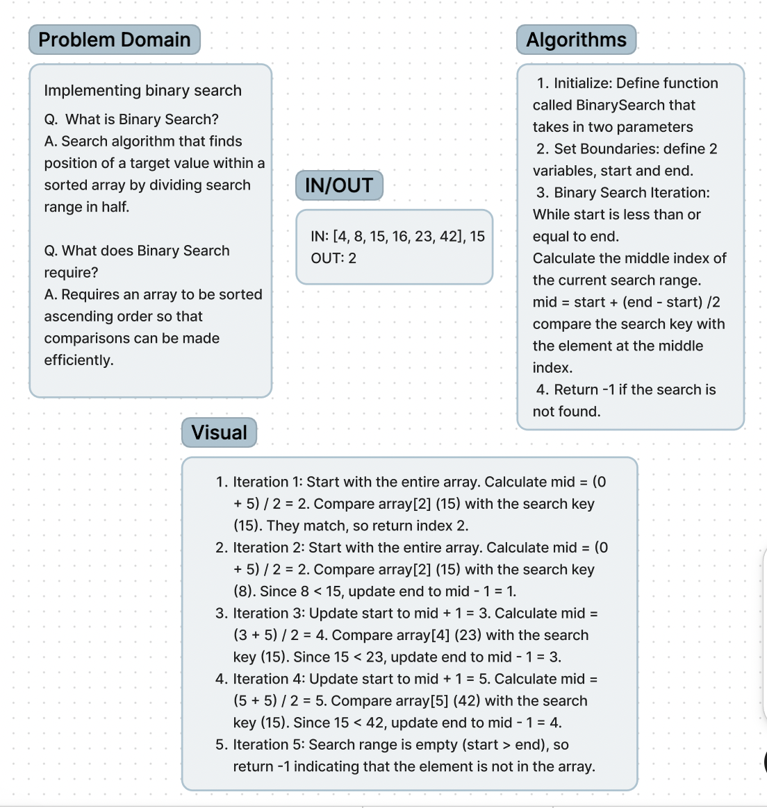

# Code Challenges

**Code Challenge 3**:
Binary search is a technique for finding a specific value in a sorted array efficiently. It works by repeatedly dividing the search interval in half and comparing the target value with the middle element of the array. If the target matches the middle element, the search is complete. If not, the search continues in the half of the array where the target may lie. Binary search requires the array to be sorted and has a time complexity of O(log n), meaning it's highly efficient, especially for large arrays. In the worst-case scenario, binary search continues until the search interval becomes empty, indicating that the target value is not present in the array.

**Whiteboard Process**:

**Approach & Efficiency**:

Initialize: Define function
called BinarySearch that
takes in two parameters
Set Boundaries: define 2
variables, start and end.
Binary Search Iteration:
While start is less than or
equal to end.
Calculate the middle index of
the current search range.
mid = start + (end - start) /2
compare the search key with
the element at the middle
index.
Return -1 if the search is
not found.
