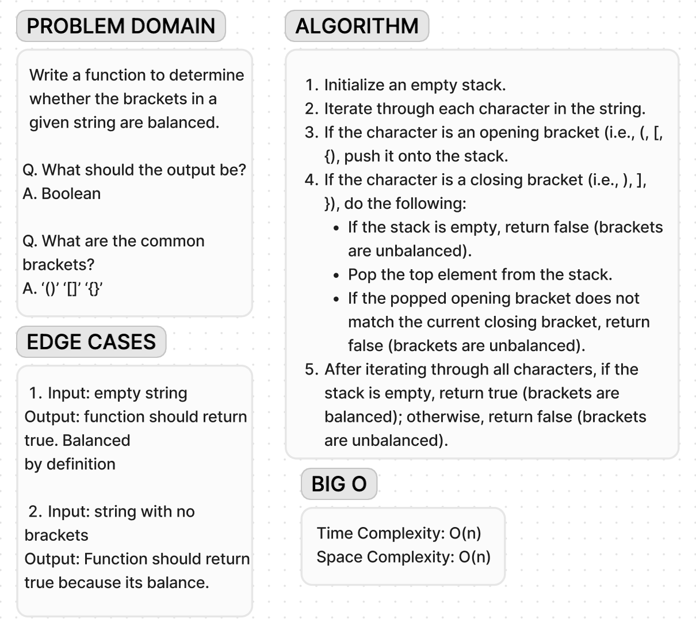

# Code Challenge 13

**Whiteboard**:

**Approach & Efficiency**:

I utilized Jest, a widely-used testing framework for JavaScript, to organize and execute the tests. Tests are categorized into scenarios where the function should return true for balanced brackets, false for unbalanced brackets, and edge cases like an empty string or no brackets.

The time complexity of the validateBrackets function is O(n), as it iterates through the input string once, performing constant-time operations for each character.

Similarly, the space complexity of the validateBrackets function is O(n) due to the stack's potential size, correlating with the input string's length.
