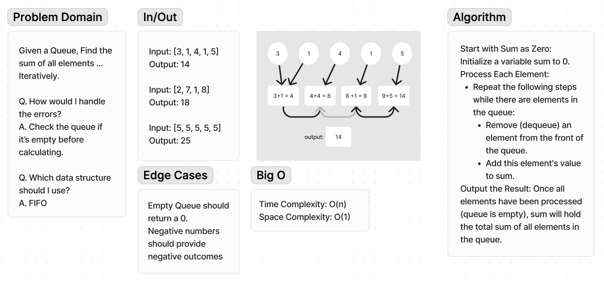

# Code Challenge 36

**Approach & Efficiency**:

Approach: Iteratively dequeue each element from the queue and accumulate their values in a sum variable.
Efficiency:
𝑂(𝑛)
O(n) time complexity ensures the algorithm scales linearly with the number of elements in the queue, making it efficient for large inputs.
𝑂(1)
O(1) space complexity indicates minimal additional memory usage.

