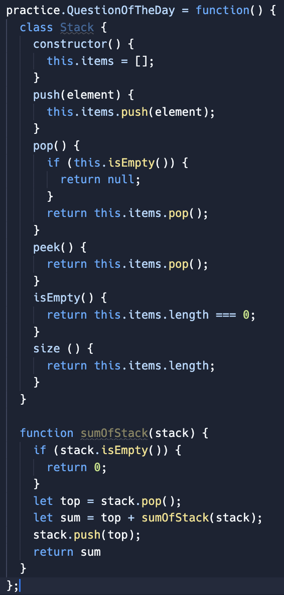
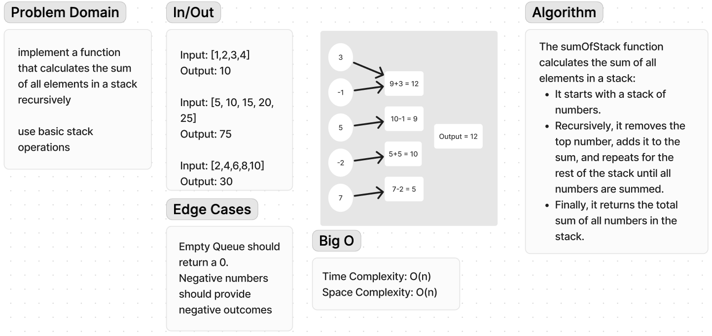

# Code Challenge 37

**Approach and Effiency**:

The sumOfStack function recursively calculates the sum of all elements in a stack:

Base Case: If the stack is empty, it returns 0.

Recursive Case: If the stack is not empty:

Remove the top element (top) from the stack.
Recursively calculate the sum of the remaining elements.
Add top to the result obtained from the recursive call.
Restore top back onto the stack.
Return Value: The function returns the accumulated sum of all elements in the stack.

Time Complexity: O(n)
The function visits each element in the stack once, resulting in linear time complexity relative to the number of elements (n) in the stack.

Space Complexity: O(n)
Due to the recursive calls, the function uses additional space on the call stack, potentially reaching a depth equal to the number of elements in the stack (n).

