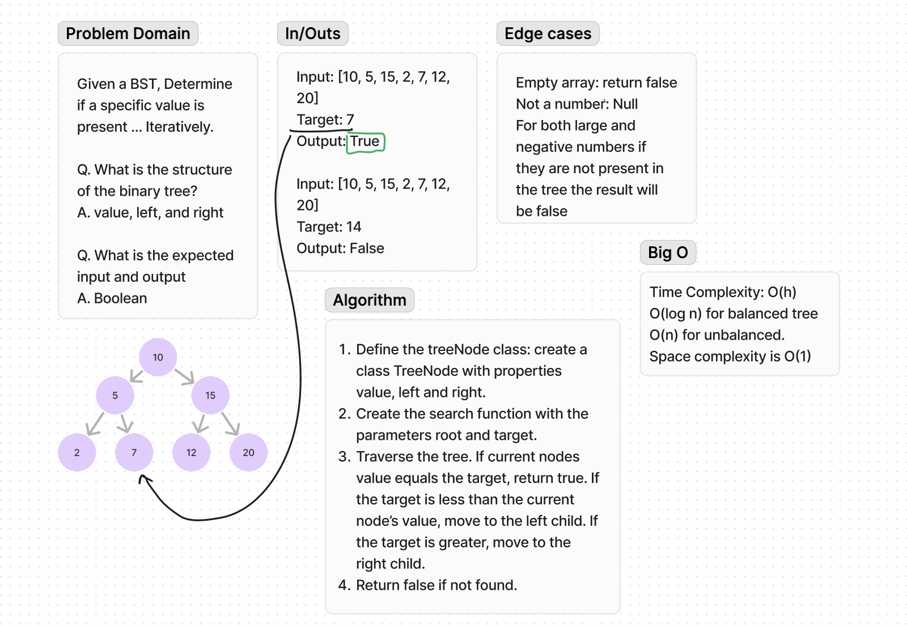
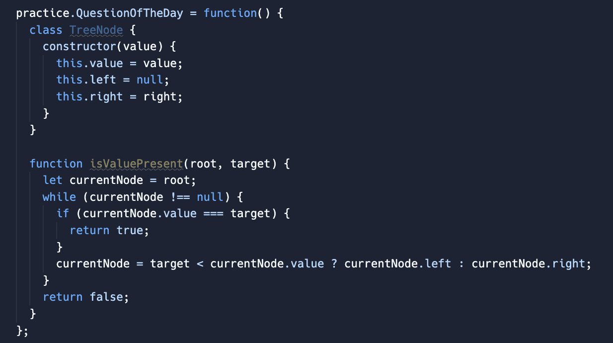

# Code Challenge 38

**Approach & Efficiency**:

To determine if a value is present in a BST, we use an iterative search algorithm. First we define the TreeNode class with properties for the node's value and its left and right children. Then we implement the isValuePresent function, which takes the root of the BST and the target value as inputs. The function starts with the root and traverses the tree using a while loop. If the current node's value matches the target, it returns true. If the target is less than the current's node's value, it moves to the left child, otherwise, it moves to he right child. If the loop ends without finding the target it returns false.

