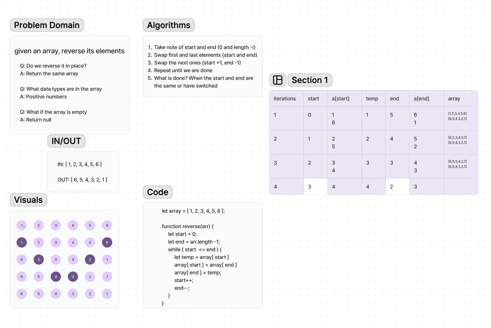

# Code Challenges

**Code Challenge 1**:

This code challenge demonstrates a method to reverse an array. The approach involves iterating through the array, swapping the first and last elements, then moving inward until the entire array is reversed.

**Whiteboard Process**:

**Approach & Efficiency**:

1. Initialize pointers start and end at the beginning and end of the array respectively.
2. Swap the elements at positions start and end.
3. Increment start and decrement end.
4. Repeat steps 2-3 until start is greater than end or they have crossed each other.

**Solution**:

let array = [1, 2, 3, 4, 5, 6];

function reverse(arr) {
    let start = 0;
    let end = arr.length - 1;
    while (start <= end) {
        let temp = array[start];
        array[start] = array[end];
        array[end] = temp;
        start++;
        end--;
    }
}

**Code Challenge 2**:

This code challenge adds a new value into the middle of an array without built in methods. This mehod maints array order while efficiently inserting the new value, showcasing a non built in approach to array manipulation.

**Whiteboard Process**:

**Approach & Efficiency**:

1. calculate middle index
2. Create new array
3. loop through new array
4. copy elements
5. return new array

**Solution**:

function insertShiftArray(arr, val) {
  const middleIndex = Math.floor(arr.length / 2);
  const newArr = new Array(arr.length + 1);

  for (let i = 0; i < newArr.length; i++) {
    if (i < middleIndex) {
      newArr[i] = arr[i];
    } else if (i === middleIndex) {
      newArr[i] = val;
    } else {
      newArr[i] = arr[i - 1];
    }
  }

  return newArr;
}
