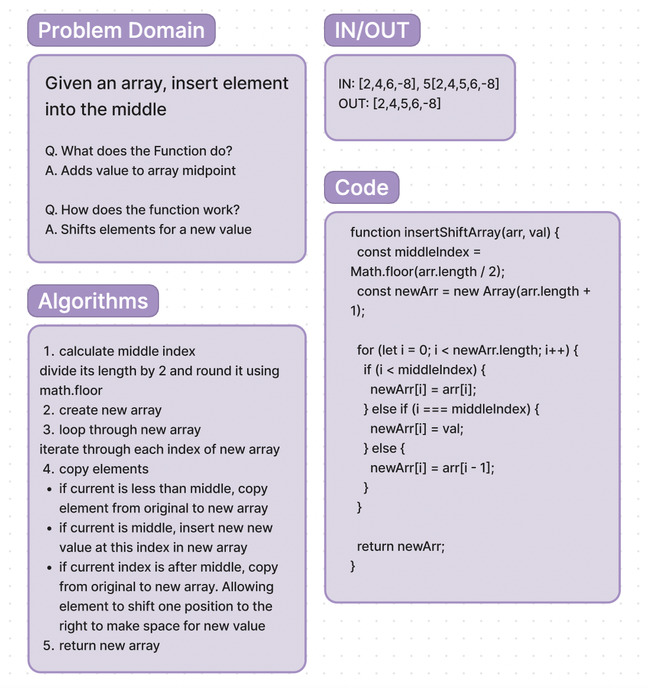

# Code Challenge

**Code Challenge 2**:

This code challenge adds a new value into the middle of an array without built in methods. This mehod maints array order while efficiently inserting the new value, showcasing a non built in approach to array manipulation.

**Whiteboard Process**:

**Approach & Efficiency**:

1. calculate middle index
2. Create new array
3. loop through new array
4. copy elements
5. return new array

**Solution**:

function insertShiftArray(arr, val) {
  const middleIndex = Math.floor(arr.length / 2);
  const newArr = new Array(arr.length + 1);

  for (let i = 0; i < newArr.length; i++) {
    if (i < middleIndex) {
      newArr[i] = arr[i];
    } else if (i === middleIndex) {
      newArr[i] = val;
    } else {
      newArr[i] = arr[i - 1];
    }
  }

  return newArr;
}
