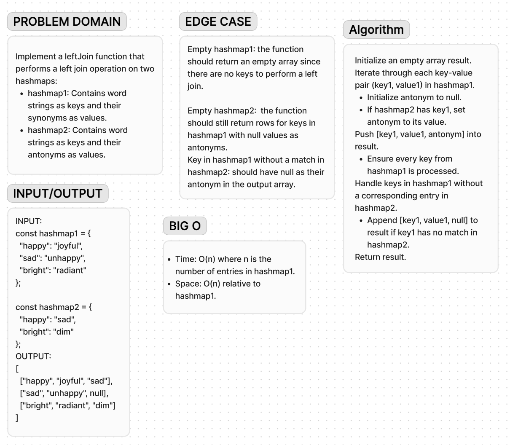

# Code Challenge 34

**Description**:

The task is to implement a leftJoin function that performs a left join operation on two hashmaps:

- hashmap1 contains word strings as keys and synonyms as values.
- hashmap2 contains word strings as keys and antonyms as values.

**Approach & Efficiency**:

Implementation Steps:
Initialize Result: Start with an empty array result to store joined data.

Iterate hashmap1 Keys:

For each key, construct a row array with:
The key itself.
The synonym (value from hashmap1).
The antonym (value from hashmap2 or null if absent).
Push Rows to Result: Add each row array to the result.

Return Result: Return the result array containing all joined rows.

Time Complexity: O(n), where n is the number of keys in hashmap1.
Space Complexity: O(n), primarily due to the result array storing all joined rows.

