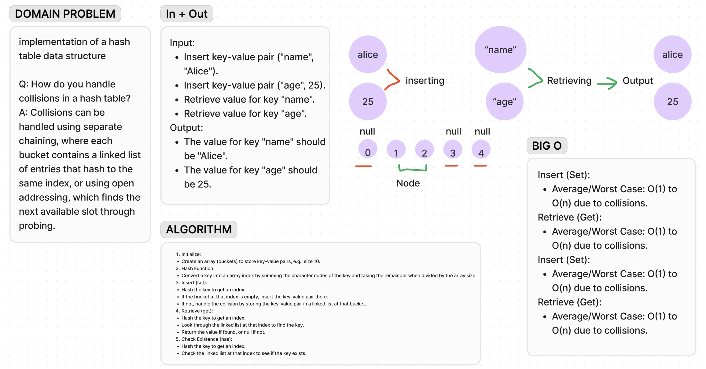

# Code Challenge 30

## Description

The code provides a basic hash table implementation using separate chaining to handle collisions. It includes methods for setting, getting, checking existence, and retrieving all keys.

## Approach & Efficiency

Hash Function:

Computes the hash value of a key by summing character codes and taking the remainder when divided by the hash table size.
Insert Method:

Inserts a key-value pair by calculating the hash, then adding it to the appropriate bucket or linked list.
Retrieve Method:

Retrieves a value by calculating the hash, then searching the linked list at that index.
Check Existence Method:

Checks if a key exists by calculating the hash and searching the linked list.
Retrieve All Keys Method:

Retrieves all unique keys by iterating through buckets and linked lists.

Insert, Retrieve, Check Existence:

Average: O(1) time complexity.
Worst Case: O(n) time complexity due to collisions.
Retrieve All Keys:

Time Complexity: O(n).
Space Complexity: O(n).

