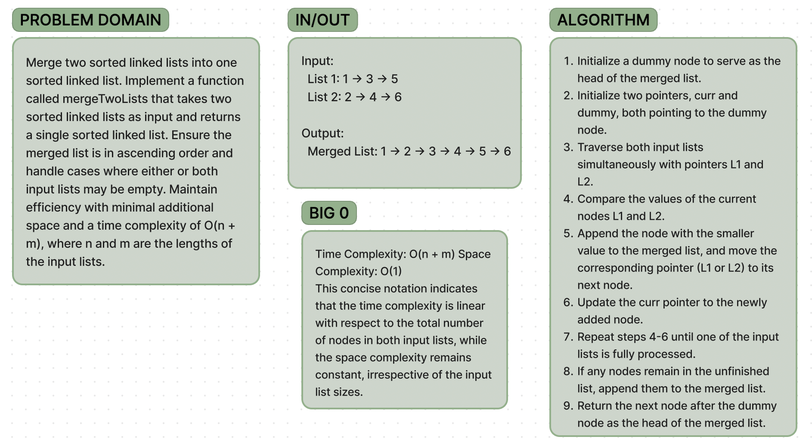

# Code Challenge 8

**Whiteboard**:

**Approach & Efficiency**:

I wrote a function mergeTwoLists that merges two sorted linked lists. It iterates through both lists simultaneously, comparing the values of the current nodes and appending the smaller one to the merged list. This continues until one of the lists is fully processed. The function has a time complexity of O(n + m), where n and m are the lengths of the input lists, as it iterates through both lists once. Its space complexity is O(1) because it only uses a constant amount of extra space regardless of the input list sizes. This approach ensures efficiency and minimal additional space usage.

**Solution**:

Save the provided code in a JavaScript file.
Open a terminal and navigate to the directory containing mergeTwoLists.js.
Run the file using Node.js with the command node mergeTwoLists.js.
To test the mergeTwoLists function, create instances of ListNode representing linked lists with values. Then, call mergeTwoLists with these instances as arguments and output the result.
