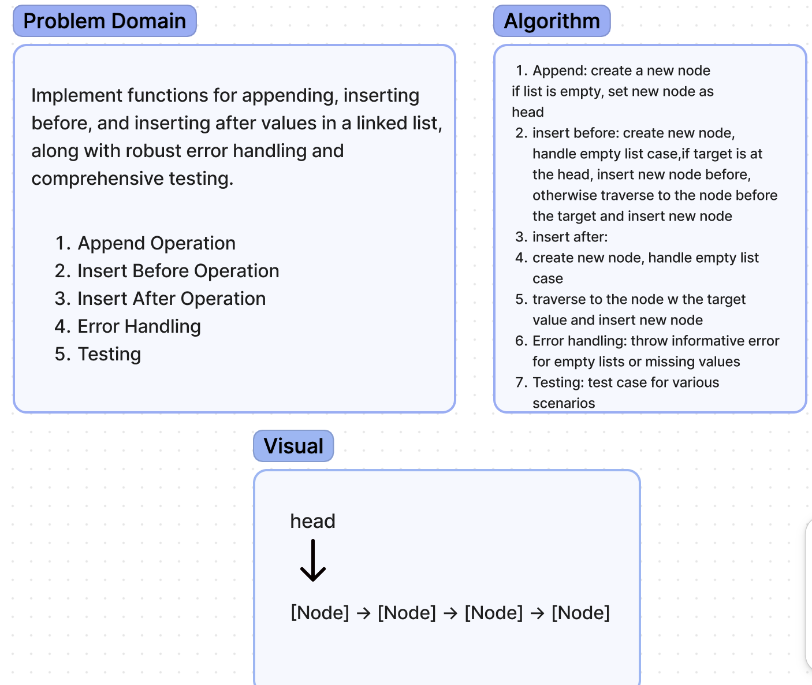

# Code Challenge 6

**Whiteboard Process**:

**Approach & Efficiency**:

To address the issue with the test case 'Insert After 3', I updated the insertAfter method to handle the scenario where the new node is inserted after the last node in the linked list. I also adjusted the test case to expect null as the value of the next node after the newly inserted node with value 5. The time complexity of the insertAfter method remains O(n), while the space complexity is O(1).

**Solution**:

1. Npm install
2. Put contents in the index and make tests in the test file
3. Run tests as npm test

Each test function represents a specific functionality being tested.
Jest will execute these tests one by one and report whether they pass or fail.
If any test fails, Jest will provide details about which test failed and why it failed.