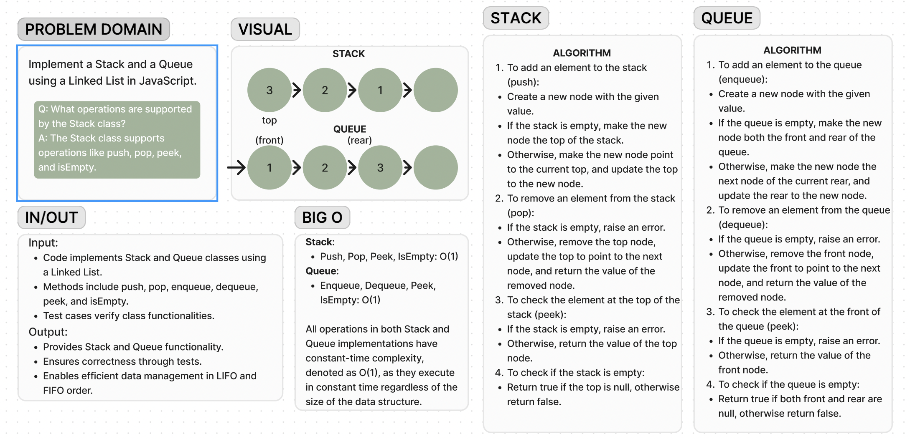

# Code Challenge 10

Implement a Stack and Queue using a Linked List in JavaScript.

**Whiteboard**:

**Approach and Effiency**:

- I used Jest to test the Stack and Queue classes. Jest provides a straightforward way to define tests and assertions. The time complexity for most operations in the Stack and Queue classes is O(1), as they involve direct pointer manipulation. The space complexity for the test file is minimal, as it only contains test descriptions and assertions. Overall, Jest is efficient for testing the functionality of the classes.

**Solution**:

1. Save the test code in a file, s%q.test.js.
2. Ensure Jest is installed in your project (npm install jest).
3. Implement your Stack and Queue classes in a separate file, index.js.
4. Open your terminal.
5. Navigate to your project directory.
6. Run npm test s&q.test.js.
7. Jest will execute the tests and display the results.
