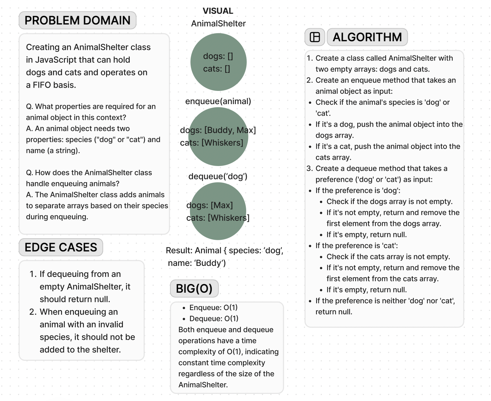

# Code Challenge 12

**Whiteboard**:

**Approach & Efficiency**:

The approach I took for analyzing the code's space and time complexity is straightforward.

I analyzed each method (enqueue and dequeue) individually to determine their time complexity.
For enqueue, adding an animal to the shelter involves simply pushing it into an array, which is a constant-time operation, denoted as O(1).
Similarly, for dequeue, removing the first element from the array (if it exists) is also a constant-time operation, denoted as O(1).
Therefore, the overall space and time complexity for both operations remains O(1), indicating constant time complexity regardless of the size of the AnimalShelter.
