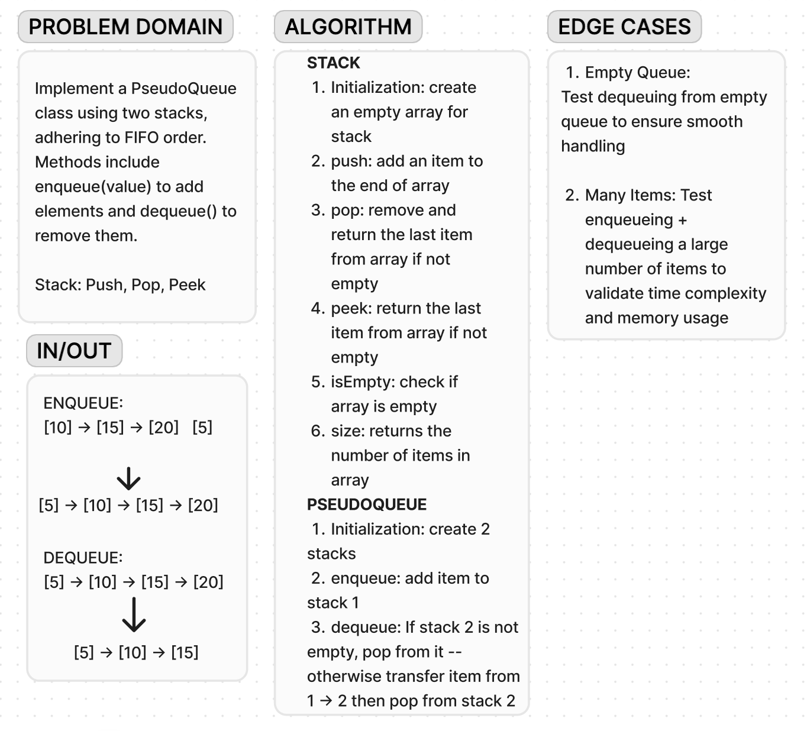

# Code Challenge 11

**Whiteboard**:

**Approach & Efficiency**:

Approach: Utilize two stacks for implementing the queue. Enqueueing items is O(1) since it involves pushing to one stack. Dequeueing items might take O(n) in the worst case, where 'n' is the number of items, due to transferring elements between stacks. However, on average, it's O(1) due to amortized time complexity.

Big O:

Time: O(1) for enqueue, amortized O(1) for dequeue
Space: O(n) for the two stacks combined, where 'n' is the number of elements in the queue.
