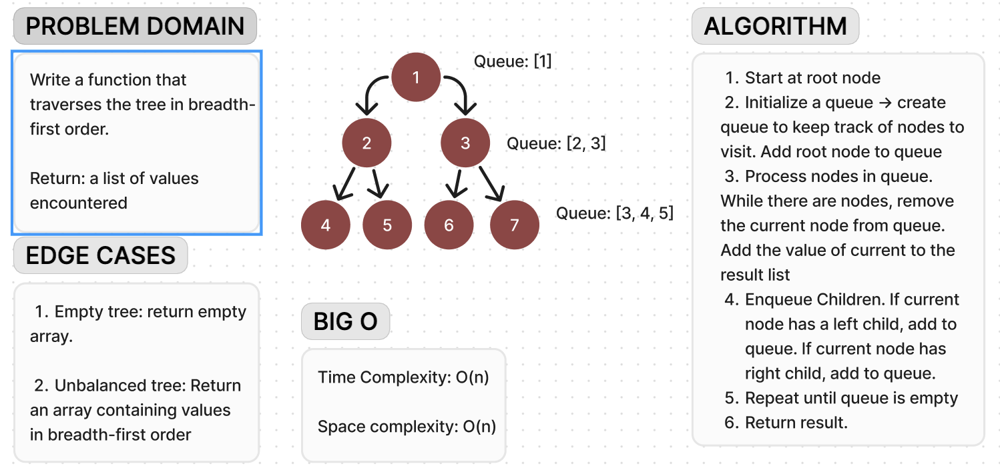

# Code Challenge 17

**Whiteboard**:

**Approach & Efficiency**:

For the breadth-first traversal algorithm implemented in the breadthFirst function, the approach taken is to use a queue data structure to visit each node level by level. This approach is chosen because it ensures that nodes are processed in the order they are encountered at each level of the tree, resulting in a breadth-first traversal.
