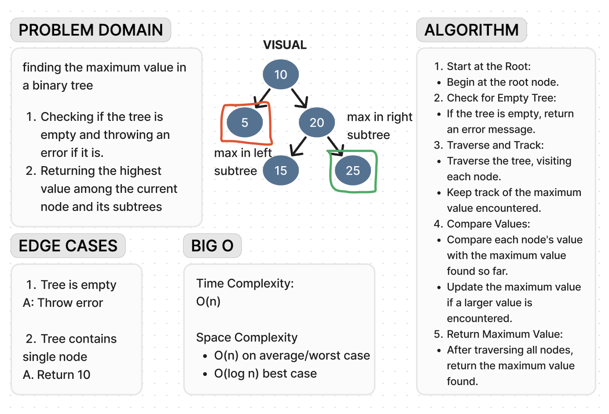

# Code Challenge 16

**Whiteboard**:

**Approach & Efficiency**:

Designed a straightforward algorithm focusing on simplicity.
Outlined steps for traversing the tree and tracking the maximum value. Prioritized clarity and ease of understanding, suitable for beginners.
Avoided technical details to keep it accessible.
