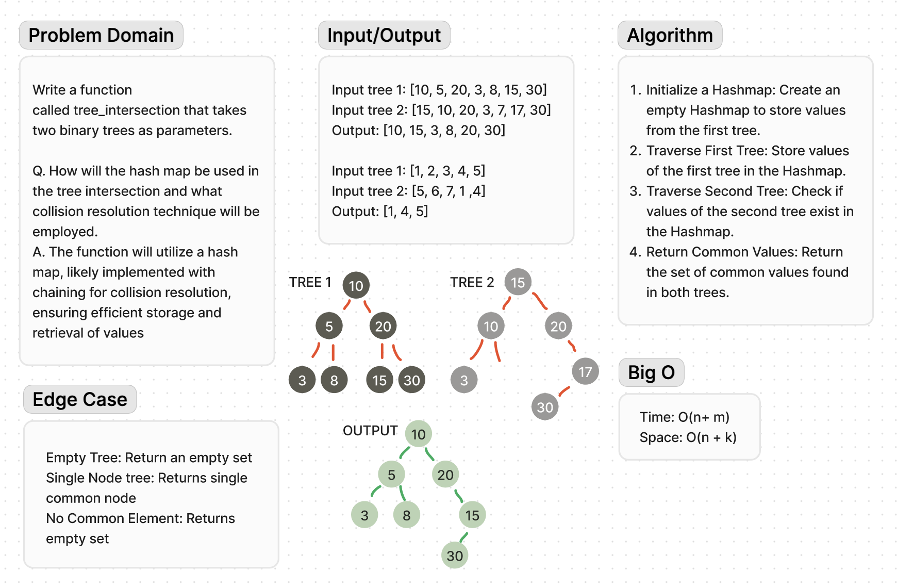

# Code Challenge 32

**Description**:

I am given two binary trees. My task is to write a function called tree_intersection that takes these two binary trees as parameters and returns a set of values found in both trees. I should use a Hashmap to achieve this.

**Approach and Efficiency**:

Traverse the First Tree:

Perform an in-order traversal of the first tree.
Store each node's value in a Hashmap to allow for O(1) average-time complexity for insertions.
Traverse the Second Tree:

Perform an in-order traversal of the second tree.
For each node's value, check if it exists in the Hashmap.
If the value is found in the Hashmap, add it to the result set.
Return the Result Set:

The result set contains all values found in both trees.

Time Complexity: O(n + m)

Where n is the number of nodes in the first tree and m is the number of nodes in the second tree.
This is because we traverse each tree once.
Space Complexity: O(n + k)

Where n is the number of nodes in the first tree (stored in the Hashmap) and k is the number of common elements (stored in the result set).
This space is used for the Hashmap and the result set.

