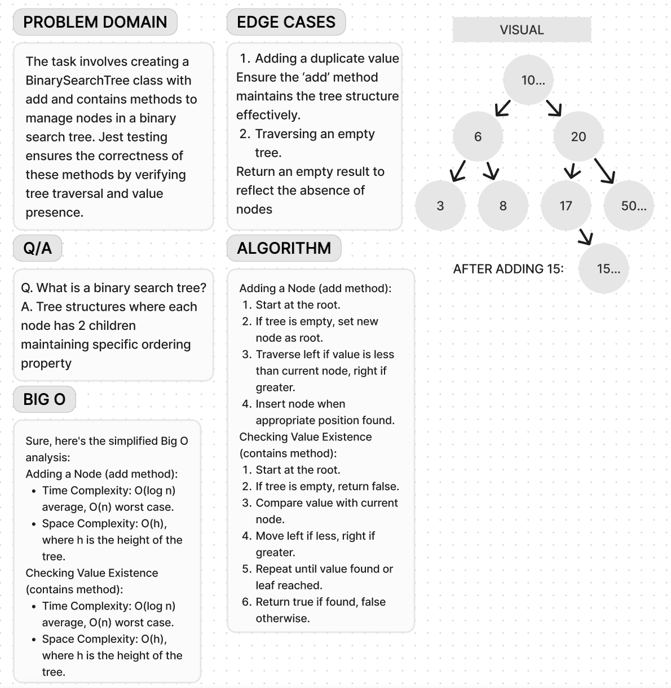

# Code Challenge 15

**Whiteboard**:

**Approach & Efficiency**:

The test suite uses Jest to verify the functionality of the BinarySearchTree class. It sets up a fresh instance before each test and checks specific behaviors such as traversal methods and the contains method. The time and space complexity of running the tests depend on the number and complexity of the individual test cases. Overall, for a small test suite like this, the impact on time complexity is usually negligible compared to the class methods being tested.
